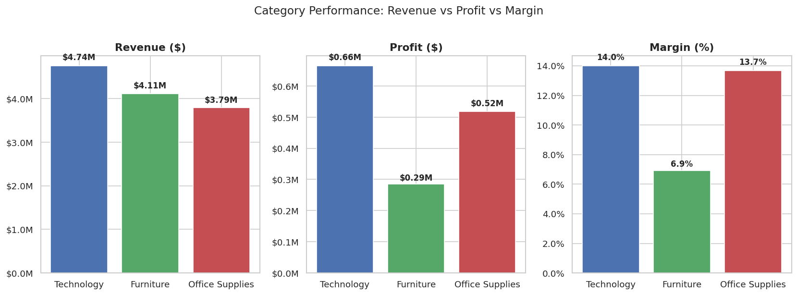
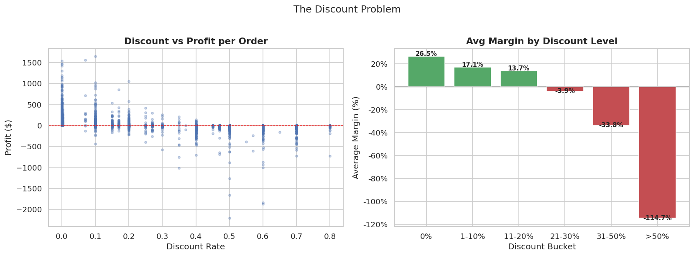
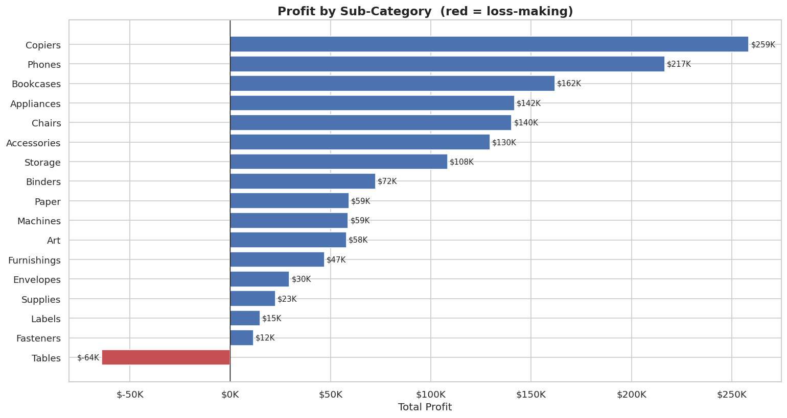
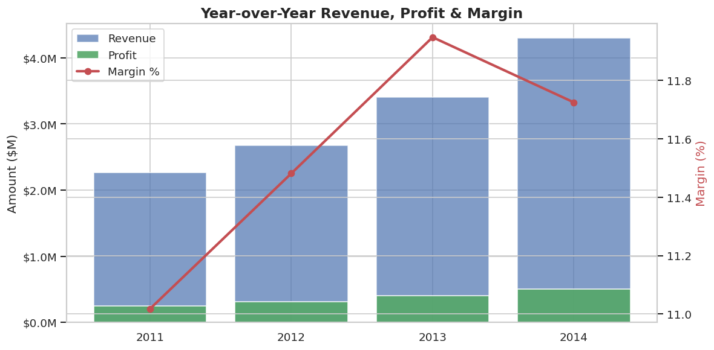

# Global Superstore Profit-Leak Analysis

**Tool:** Python (Jupyter) + Excel  
**Dataset:** [Global Superstore](https://www.kaggle.com/datasets/apoorvaappz/global-super-store-dataset) — 51,290 orders across 7 global markets, 2011–2014  
**Domain:** Retail / E-commerce

---

## Business Question

> *Which product categories and markets are destroying profit — and what should leadership cut, fix, or double down on?*

The company is growing revenue year-over-year, but profitability has not kept pace. This analysis traces the root causes: which sub-categories are structurally loss-making, how discount policy drives margin collapse, and which markets are genuinely healthy vs. subsidised by the rest of the portfolio.

---

## Approach

1. **Data cleaning** — dropped the Postal Code column (80% missing), parsed order/ship dates, confirmed no duplicate order rows.
2. **KPI computation** — revenue, profit, margin, YoY growth, loss-making order rate.
3. **Segmentation** — profitability broken down by Category, Sub-Category, Market, and Discount tier.
4. **Discount analysis** — bucketed discounts into six tiers and computed average margin per tier; calculated Pearson correlation between discount rate and profit.
5. **Trend analysis** — year-over-year revenue, profit, and margin trajectory from 2011 to 2014.
6. **Dashboard** — five-sheet interactive Excel workbook with KPI cards, sortable/filterable tables, and annotated charts.

---

## Key Findings

| # | Finding |
|---|---------|
| F1 | **Tables is the only loss-making sub-category** — $757K revenue, -$64K profit. Average discount on Tables is ~30%, which the list price structurally cannot absorb. |
| F2 | **Discounts above 20% systematically destroy margin.** Discount-profit correlation: -0.32. Orders with >30% discount average -15% margin. |
| F3 | **Furniture drags the portfolio** at 6.9% margin vs 14% for Technology. High revenue masks poor conversion to profit. |
| F4 | **EMEA is the weakest market** at 5.4% margin — revenue growth there is currently value-destructive. |
| F5 | **APAC and EU are the real engines** — together $809K profit (55% of total) at ~12% margins. Under-invested relative to their returns. |
| F6 | **24.5% of order rows are loss-making**, generating -$920K that partially cancels $2.39M gross profit from profitable orders. |

---

## Dashboard Preview

> *Open `Global_Superstore_Dashboard.xlsx` to interact — all tables have live filter/sort arrows.*

**Dashboard — KPIs + Category & Market tables**



**Discount impact on margin**



**Sub-category profit ranking**



**Year-over-year revenue, profit & margin**



---

## Recommendations

| # | Action | Rationale |
|---|--------|-----------|
| R1 | Reprice or exit Tables | Recovering ~$75K–$100K/year at current volumes with zero-discount policy |
| R2 | Hard cap discounts at 20%, manager approval above | Projected $150K–$200K annual margin recovery |
| R3 | Redirect growth investment to APAC and EU | Both markets are proven and scalable at ~12% margins |
| R4 | Commission an EMEA operational audit before expanding | Diagnose whether the 5.4% margin is structural or fixable |

---

## Files

```
├── Global_Superstore_Analysis.ipynb   # Full EDA notebook
├── Global_Superstore_Dashboard.xlsx   # Interactive 5-sheet Excel dashboard
├── Global_Superstore2.csv             # Raw dataset (Kaggle, CC0 license)
├── chart_*.png                        # Chart exports from the notebook
└── README.md
```

---

## Tools Used

- **Python** — pandas, numpy, matplotlib, seaborn (Jupyter Notebook)
- **Excel** — openpyxl, KPI cards, Excel Tables with autofilter, conditional formatting, combo charts

---

## What I'd Do with More Time or Data

- Add **customer-level data** (if available) to identify whether high-discount orders are concentrated in a small set of accounts — which would change the intervention from a blanket discount cap to a targeted account review.
- Build a **profit recovery model**: simulate the margin impact of raising Table prices by 5%, 10%, 15% under different demand elasticity assumptions.
- Replicate in **Power BI** with slicers, so business users can filter by market and time period interactively without needing Excel.
- Add **statistical testing** (e.g. t-test on profit means across discount tiers) to confirm that the margin differences are not sampling noise.

---

*Analyst: Somto Ogene | [LinkedIn](https://www.linkedin.com/in/ogenesomto) | June 2026*
